# Progetto piattaforme digitali per la gestione del territorio
Giammarco Gaudini - Matricola N°285766
# Descrizione
Creazione di una rest api di un semplice negozio

# Architettura
Il codice è scritto interamente in javascript. Le informazioni vengono acquisite e immagazzinate in un database (fornito da MongoDB). Per integrare il database è stato usato mongoose ovvero una serie di pacchetti che consentono di definire gli oggetti del database attraverso uno schema prefissato. E' stato usato il framework Express per Node.js.
# server.js
File che crea un server locale, esso userà la porta 3000 e si mette in ascolto su essa.
# app.js
Questo file serve per gestire tutte le richieste fatte dall'utente in maniera efficiente.
Vengono importti tutti i pacchetti necessari per il corretto funzionamento del sistema. Avviene il collegamento con il database esterno (MongoDB), e vengono dichiarati i percorsi che devono gestire le richieste. Infine avviene la gestione degli errori globali.

# api (folder) 
Cartella che gestisce i percorsi e i modelli
## products.js/routes
Gestisce le richieste relative ai prodotti.
Vengono importati i pacchetti necessari e il modello dei prodotti dalla cartella models. Successivamente vengono implementate le richieste GET, POST, GET(di un singolo prodotto), DELETE.
## orders.js/routes
Gestisce le richieste relative agli ordini.
Vengono importati i pacchetti necessari e il modello degli ordini dalla cartella models. Successivamente vengono implementate le richieste GET, POST, GET(di un singolo ordine), DELETE.
## user.js/routes
Gestisce le richieste relative agli utenti.
Vengono importati i pacchetti necessari e il moello degli utenti dalla cartella models.
Successivamente vengono implementate le richieste POST(signup), POST(login), DELETE.
## product.js/models
Definisce come dovrebbe apparire il prodotto all'interno dell'applicazione.
## order.js/models
Definisce come dovrebbe apparire l'ordine all'interno dell'applicazione.
## user.js/models
Definisce come dovrebbe apparire l'utente all'interno dell'applicazione.

# Documentazione
## esempi
### Products

-GET(tutti i prodotti): URL -> https://localhost:3000/products
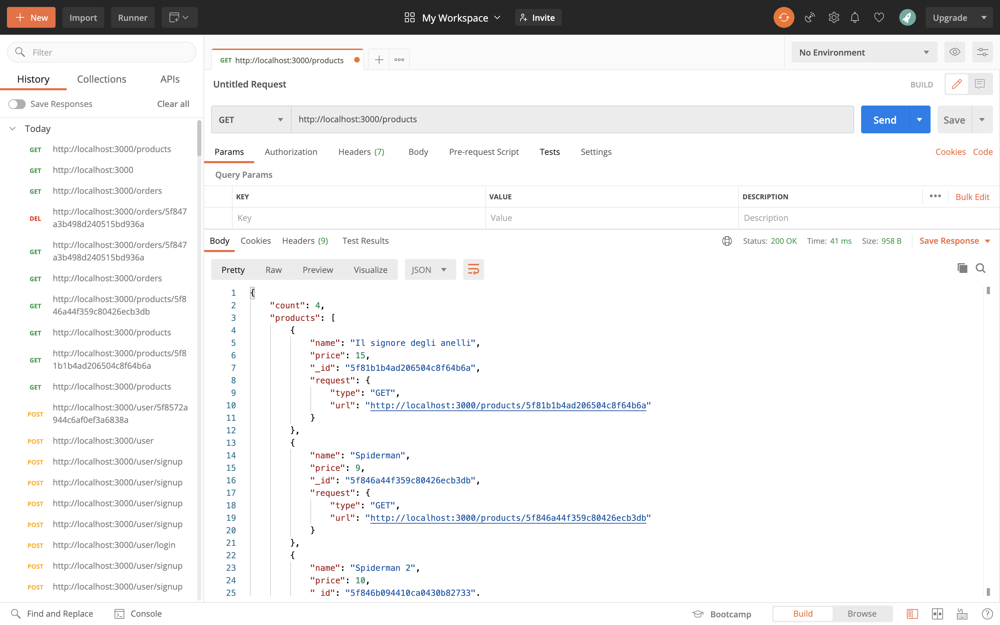

-GET(singolo prodotto): URL -> https://localhost:3000/products/+id
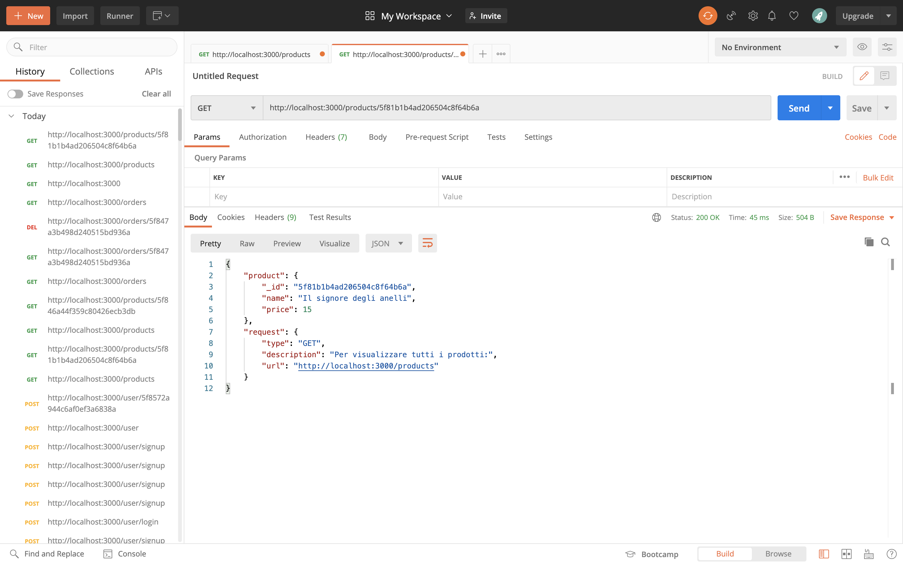

-POST: URL -> https://localhost:3000/products
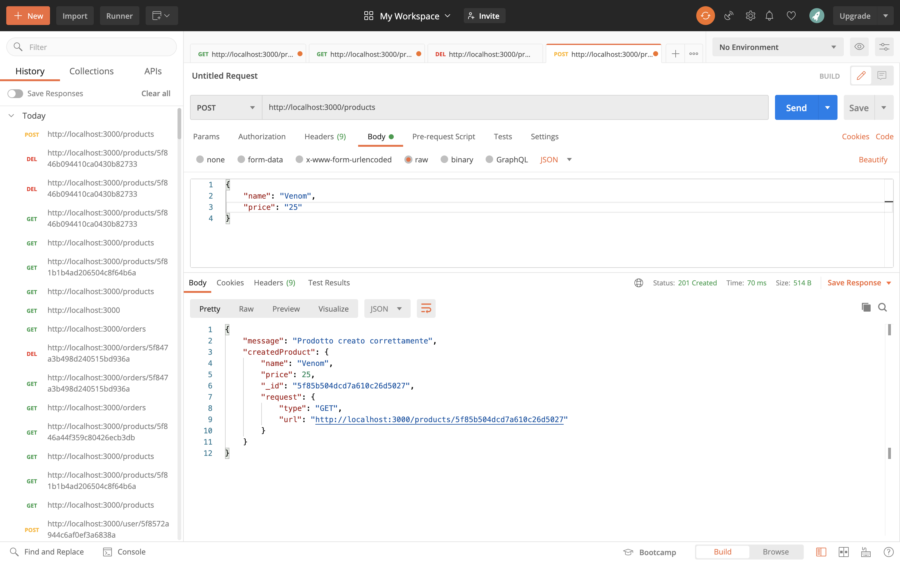

-PATCH: URL -> https://localhost:3000/products/+id
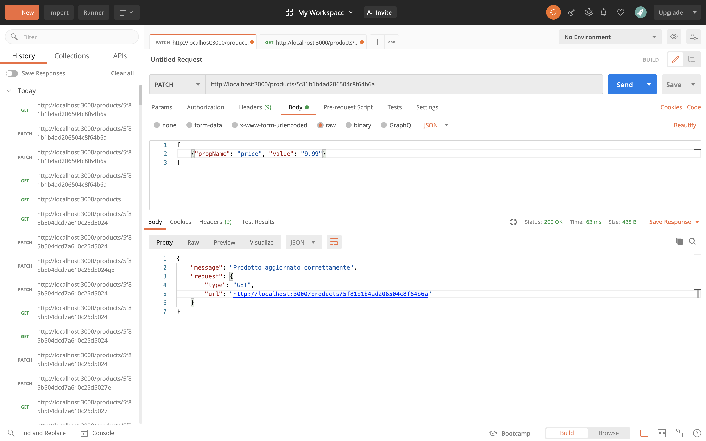

-DELETE: URL -> https://localhost:3000/products/+id
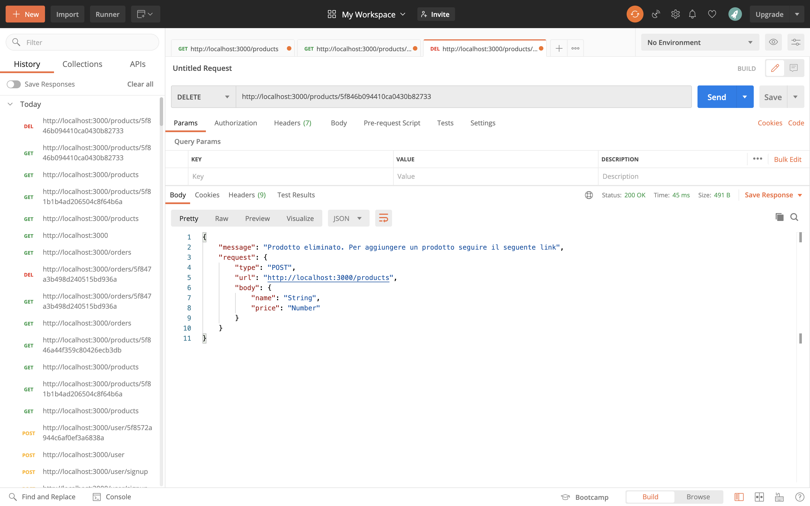

### Orders

-GET(tutti gli ordini): URL -> https://localhost:3000/orders
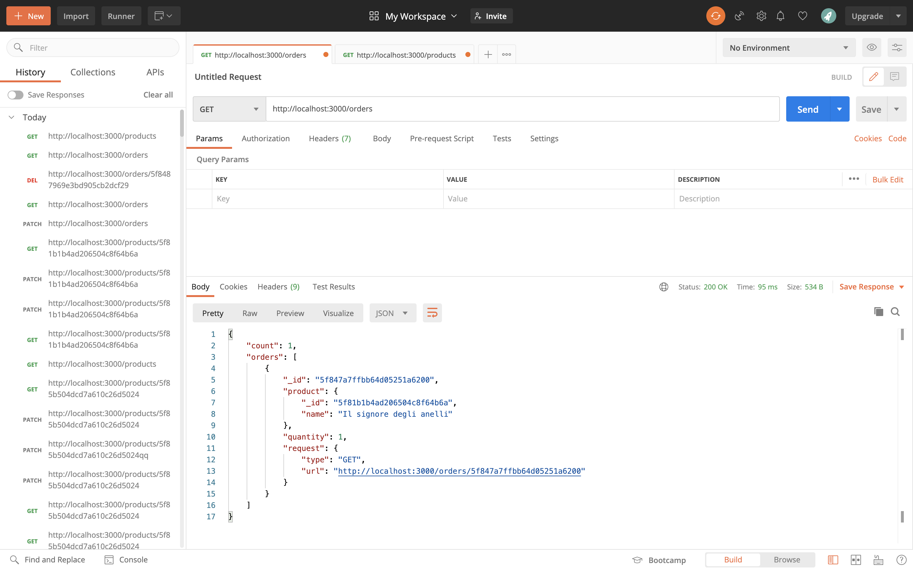

-GET(singolo ordine): URL -> https://localhost:3000/orders/+id
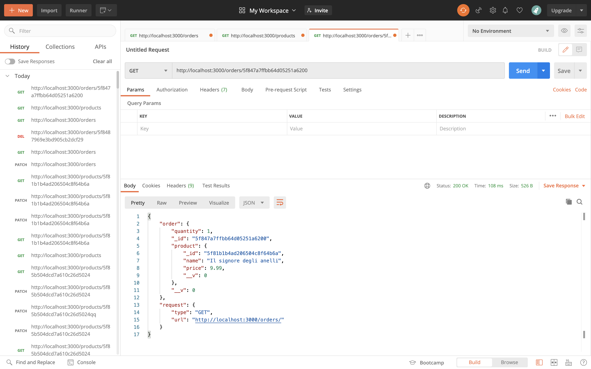

-POST: URL -> https://localhost:3000/orders
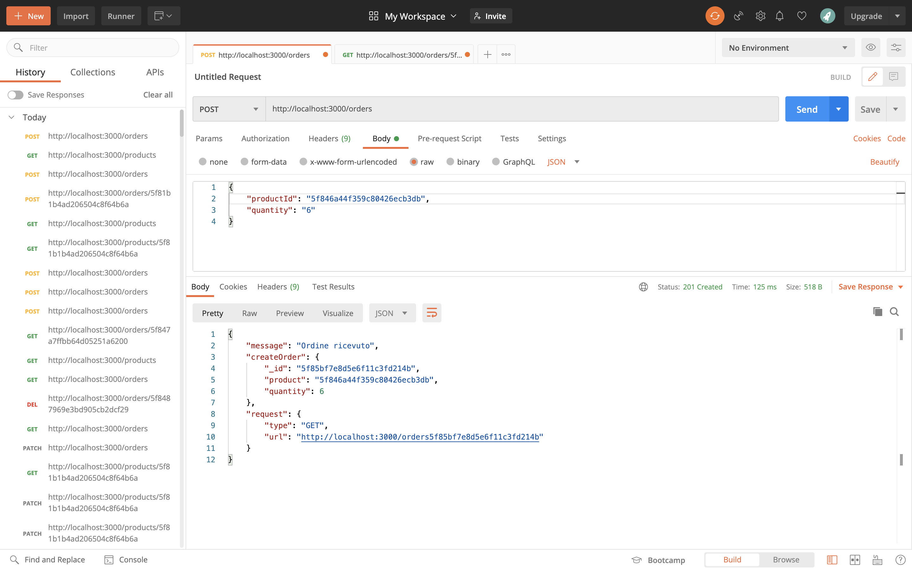

-DELETE: URL -> https://localhost:3000/orders/+id
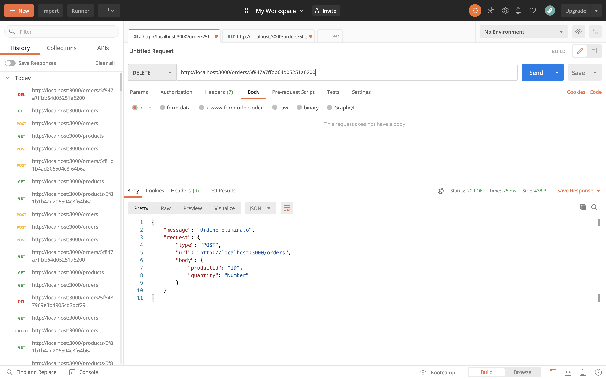

### Users

POST(creazione utente): URL -> https://localhost:3000/user/signup
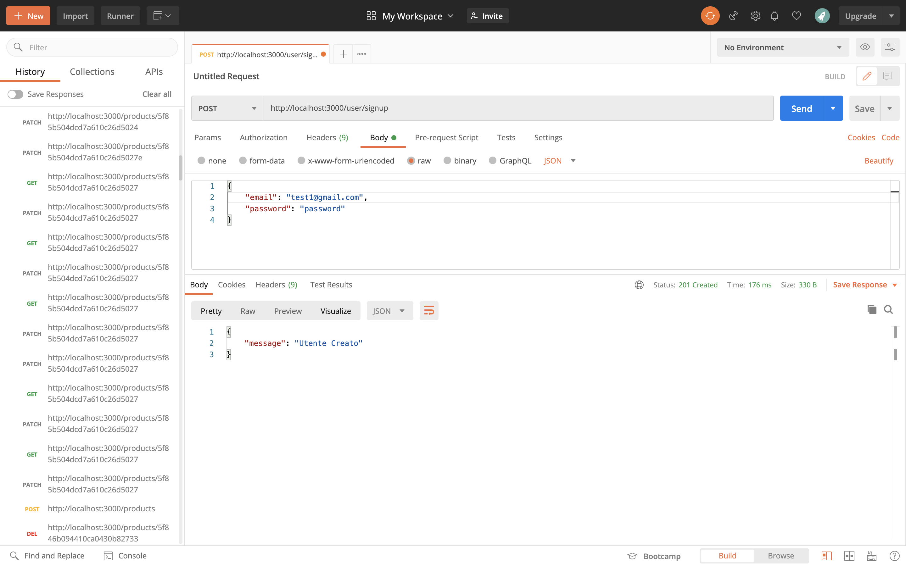

POST(login utente): URL -> https://localhost:3000/user/login
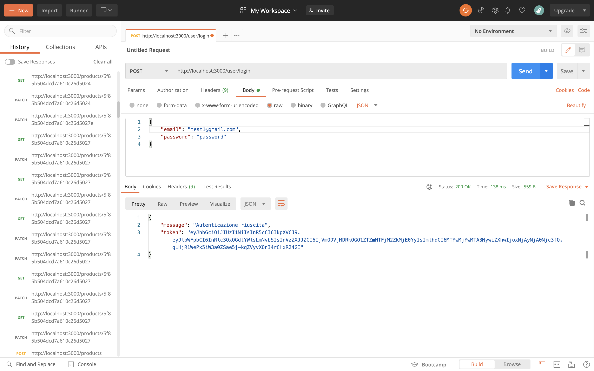

